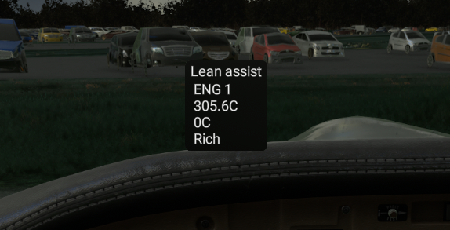
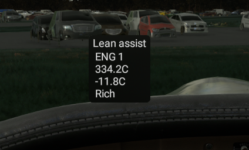
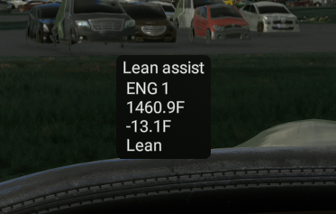
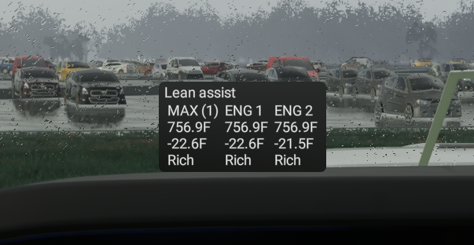

# Flow Lean Assist Widget

Simple Lean Assist widget, keeps track of peak EGT and tells you if you're rich or lean of peak EGT. Also shows the difference between peak and current EGT.
Multi-engine shows for each engine with a "Max" column for the peak.

[Download here](https://github.com/ranbogmord/flow-leanassist/releases)

